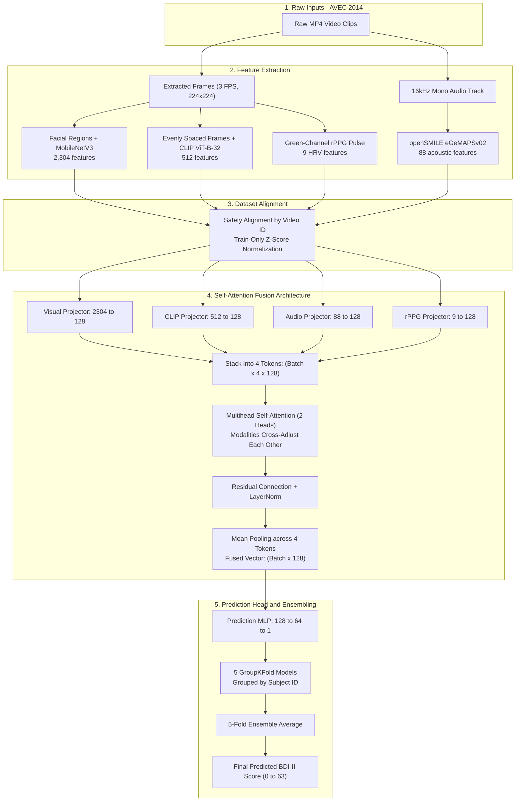

# Automated Depression Severity Estimation: Complete Architecture Guide

> **Audience**: Undergraduate students, researchers, and developers who want a clear, jargon-free understanding of how this multimodal deep learning system detects depression severity from video, audio, and physiological signals.
>
> 💡 *Note*: This document covers the **Self-Attention Fusion** architecture. For the newer, missing-modality-robust **Evidence-Based (Uncertainty-Weighted) Fusion** model, see [EVIDENCE_FUSION_ARCHITECTURE_EXPLAINED.md](file:///e:/TUKL/Depression-Severity-Estimation/docs/EVIDENCE_FUSION_ARCHITECTURE_EXPLAINED.md).

---

## Table of Contents
1. [The Big Picture: An Intuitive Analogy](#1-the-big-picture-an-intuitive-analogy)
2. [The 4 Modalities: What the AI Observes](#2-the-4-modalities-what-the-ai-observes)
3. [Architecture Deep-Dive: How Data Flows](#3-architecture-deep-dive-how-data-flows)
4. [Jargon Buster: Plain-English Definitions](#4-jargon-buster-plain-english-definitions)
5. [Why It Works: The 4 Core Engineering Wins](#5-why-it-works-the-4-core-engineering-wins)
6. [Failure Modes & Critical Limitations](#6-failure-modes--critical-limitations)
7. [Documented Ablation Experiments & Key Findings](#7-documented-ablation-experiments--key-findings)
8. [Final Replicated Benchmark Scorecard](#8-final-replicated-benchmark-scorecard)

---

## 1. The Big Picture: An Intuitive Analogy

Imagine a panel of four specialized medical investigators assessing a patient during an interview:

```
                  ┌──────────────────────────────────────────────┐
                  │              PATIENT INTERVIEW               │
                  └───────┬──────────┬──────────┬─────────┬──────┘
                          │          │          │         │
                          ▼          ▼          ▼         ▼
                     [Face/Muscles] [Gaze]   [Voice]   [Pulse]
                          │          │          │         │
                          ▼          ▼          ▼         ▼
                  ┌──────────────────────────────────────────────┐
                  │             ROUND-TABLE CONSULTATION         │
                  │              (Self-Attention Fusion)         │
                  │   "Face looks flat, and voice lacks energy.  │
                  │    They agree -> High confidence severity!"  │
                  └──────────────────────┬───────────────────────┘
                                         │
                                         ▼
                            PREDICTED BDI-II SCORE (0 - 63)
```

1. **The Facial Muscle Analyst (MobileNetV3)** watches microscopic muscle movements in the eyes, mouth, and cheeks.
2. **The Visual Context Observer (OpenCLIP ViT-B-32)** looks at the patient holistically—posture, gaze, overall tiredness, and facial affect.
3. **The Voice & Speech Analyst (openSMILE)** ignores the words being said and listens exclusively to the acoustic properties: pitch flatness, vocal tremors, breathiness, and pauses.
4. **The Contactless Pulse Monitor (Green-Channel rPPG)** tracks subtle, invisible skin color fluctuations caused by blood pumping in the face to estimate heart rate and stress.

Instead of having just one person make the guess, **Self-Attention Fusion** acts as a round-table conference where all four specialists cross-examine each other's observations. If the voice sounds depressed and the facial muscles agree, the model boosts confidence. If the pulse monitor is noisy, the other specialists down-weight its influence.

---

## 2. The 4 Modalities: What the AI Observes

| Modality | Extractor | Feature Dim | What It Measures in Plain English | Clinical Rationale |
| :--- | :--- | :--- | :--- | :--- |
| **Facial Region Dynamics** | Frozen MobileNetV3-Small | **2,304** | Focuses on 4 anatomical face zones: Eyes, Mouth, Left Cheek, Right Cheek. | Depression inhibits spontaneous facial expression (blunted affect). Micro-movements around the eyebrows and mouth corners freeze or droop. |
| **Visual-Semantic Context** | Frozen OpenCLIP (ViT-B-32) | **512** | Global holistic appearance, facial semantics, head tilt, and tired gaze. | Foundation vision-language models have seen millions of human faces and understand high-level emotional concepts without fine-tuning. |
| **Acoustic Functionals** | openSMILE (eGeMAPSv02) | **88** | Pitch (F0), loudness, jitter (micro-pitch trembling), shimmer (amplitude trembling), spectral slope. | "Depressive speech" sounds dull, low-pitched, monotonous, and slow, with longer pauses between utterances. |
| **Physiological Pulse (rPPG)** | Green Channel Bandpass Filter | **9** | Contactless heart rate, beat-to-beat intervals (RR), Heart Rate Variability (SDNN, RMSSD, LF/HF ratio). | The autonomic nervous system is altered in major depressive disorder, causing changes in sympathetic vs. parasympathetic tone. |

---

## 3. Architecture Deep-Dive: How Data Flows

```text
┌─────────────────────────────────────────────────────────────────────────────────────────────────┐
│ 1. RAW DATASET (AVEC 2014)                                                                      │
│    • 300 Video Clips (.mp4) recorded from Human-Computer Interaction Sessions                   │
└─────────────────────────────────┬─────────────────────────────────┬─────────────────────────────┘
                                  │ (Frame Extraction at 3 FPS)     │ (Audio Track Extraction)
                                  ▼                                 ▼
         ┌─────────────────────────────────────────┐       ┌──────────────────────────────────┐
         │ 2. FACIAL FRAMES (224x224 JPEGs)        │       │ 16kHz Mono WAV Audio Tracks      │
         └────────┬───────────────────────┬────────┘       └────────────────┬─────────────────┘
                  │                       │                                 │
                  ▼                       ▼                                 ▼
         ┌─────────────────┐     ┌─────────────────┐               ┌─────────────────┐
         │   MobileNetV3   │     │    OpenCLIP     │               │    openSMILE    │
         │  (Facial AUs)   │     │   (ViT-B-32)    │               │  (eGeMAPSv02)   │
         │  4 Face Zones   │     │  Holistic Gaze  │               │  Pitch, Jitter  │
         │ 2,304 features  │     │  512 features   │               │   88 features   │
         └────────┬────────┘     └────────┬────────┘               └────────┬────────┘
                  │                       │                                 │
                  │                       │     ┌─────────────────────┐     │
                  │                       └────►│  Green-Channel rPPG │◄────┘ (Face ROI green signal)
                  │                             │  Pulse & HRV Stats  │
                  │                             │     9 features      │
                  │                             └──────────┬──────────┘
                  │                                        │
                  ▼                                        ▼
┌─────────────────────────────────────────────────────────────────────────────────────────────────┐
│ 3. LEAK-FREE ALIGNMENT & TRAIN-ONLY NORMALIZATION (dataset.py)                                  │
│    • Aligned by video_id (297 valid samples: 98 Train, 99 Dev, 100 Test)                       │
│    • Z-Score Normalized using strictly Training statistics: (x - μ_train) / σ_train             │
└────────────────────────────────────────────────┬────────────────────────────────────────────────┘
                                                 │
                                                 ▼
┌─────────────────────────────────────────────────────────────────────────────────────────────────┐
│ 4. SELF-ATTENTION FUSION ARCHITECTURE (models_attention.py)                                     │
│                                                                                                 │
│   Visual (2304)  ──► [Projector: Linear + LayerNorm + ReLU + Drop(0.6)] ──► 128                 │
│   CLIP   (512)   ──► [Projector: Linear + LayerNorm + ReLU + Drop(0.6)] ──► 128                 │
│   Audio  (88)    ──► [Projector: Linear + LayerNorm + ReLU + Drop(0.6)] ──► 128                 │
│   rPPG   (9)     ──► [Projector: Linear + LayerNorm + ReLU + Drop(0.6)] ──► 128                 │
│                                                                                                 │
│                                      Stack into 4 Tokens                                        │
│                                               │                                                 │
│                                               ▼                                                 │
│                          ┌──────────────────────────────────────────┐                           │
│                          │   MULTI-HEAD SELF-ATTENTION (2 Heads)    │                           │
│                          │   Modalities cross-attend & weigh each   │                           │
│                          │   other dynamically based on agreement   │                           │
│                          └────────────────────┬─────────────────────┘                           │
│                                               │                                                 │
│                                               ▼                                                 │
│                                  Residual Connection + LayerNorm                                │
│                                               │                                                 │
│                                               ▼                                                 │
│                                 Mean Pooling Across 4 Tokens                                    │
│                                               │                                                 │
│                                               ▼                                                 │
│                                  Unified Fused Vector (128-dim)                                 │
└───────────────────────────────────────────────┬─────────────────────────────────────────────────┘
                                                │
                                                ▼
┌─────────────────────────────────────────────────────────────────────────────────────────────────┐
│ 5. PREDICTION HEAD & 5-FOLD ENSEMBLING (train_cv_safe_attention.py)                             │
│                                                                                                 │
│   Linear(128 → 64) ──► ReLU ──► Dropout(0.6) ──► Linear(64 → 1)                                │
│                                                                                                 │
│   [Fold 1 Model]    [Fold 2 Model]    [Fold 3 Model]    [Fold 4 Model]    [Fold 5 Model]        │
│         │                 │                 │                 │                 │               │
│         └─────────────────┴────────┬────────┴─────────────────┴─────────────────┘               │
│                                    │ (Average 5 Model Predictions)                              │
│                                    ▼                                                            │
│                      PREDICTED BDI-II DEPRESSION SCORE (0 - 63)                                 │
└─────────────────────────────────────────────────────────────────────────────────────────────────┘
```

<details>
<summary><b>Click to expand Mermaid syntax (for GitHub/viewers with Mermaid support)</b></summary>



</details>

### Detailed Component Steps:
1. **Modality Projectors**:
   - Each modality starts with a completely different dimension: Visual is 2,304, CLIP is 512, openSMILE is 88, and rPPG is 9.
   - A linear projection layer projects every modality into an identical **128-dimensional latent space**.
   - Heavy regularization (`LayerNorm` + `Dropout(0.6)`) prevents the model from memorizing training samples.

2. **Self-Attention Fusion Layer**:
   - The 4 modality vectors are arranged as **4 separate tokens** in a sequence: `[Token_Visual, Token_CLIP, Token_Smile, Token_rPPG]`.
   - A multi-head self-attention layer computes attention weights between every pair of modalities.
   - For example, if openSMILE signals high severity, self-attention checks if CLIP and MobileNetV3 visual features support this conclusion.

3. **Residual Connection & Pooling**:
   - A residual bypass preserves the original projected information while incorporating the attention-adjusted signals.
   - Mean-pooling collapses the 4 adjusted tokens into one unified 128-dimensional feature vector.

4. **Prediction Head**:
   - A two-layer MLP (`128 -> 64 -> 1`) maps the fused vector directly to a single continuous scalar: the **BDI-II depression severity score**.

---

## 4. Jargon Buster: Plain-English Definitions

| Technical Term | What It Literally Means | Why We Care |
| :--- | :--- | :--- |
| **BDI-II** *(Beck Depression Inventory-II)* | A 21-question clinical questionnaire scored from **0 to 63**. | This is our ground-truth target. (0–13: Minimal; 14–19: Mild; 20–28: Moderate; 29–63: Severe). |
| **MAE** *(Mean Absolute Error)* | Average distance between the predicted score and the true score. | Lower is better. If MAE is 7.5, our prediction is off by ~7.5 points on a 63-point scale on average. |
| **RMSE** *(Root Mean Square Error)* | Penalizes large errors much more aggressively than MAE. | If a model is wildly wrong on even a few patients, RMSE shoots up. Lower is better. |
| **PCC** *(Pearson Correlation)* | Measures whether the predictions trend up and down in sync with true scores (range: -1 to +1). | A PCC of ~0.58 means the AI strongly tracks the relative severity between patients. |
| **CCC** *(Concordance Correlation)* | Measures both correlation **and** absolute agreement (range: -1 to +1). | Unlike PCC, if the AI predicts 10 points too high across the board, PCC stays high but CCC drops. |
| **rPPG** *(Remote Photoplethysmography)* | Measuring pulse through a regular camera without touching the patient. | Uses the green light channel of video frames to observe blood volume changes beneath the facial skin. |
| **eGeMAPSv02** | Extended Geneva Minimalistic Acoustic Parameter Set. | An internationally recognized standard of 88 voice features designed specifically for psychological and affective computing. |
| **GroupKFold (Leak-Free CV)** | Splitting the training data into 5 folds grouped by **person ID**. | A single person must **never** be in both train and validation splits. Violating this causes catastrophic data leakage and fake accuracy. |
| **Ensembling** | Combining the predictions of multiple distinct models by averaging. | Ensembling 5 models smooths out individual model quirks and consistently lowers MAE by 0.4 to 0.8 points. |
| **Frozen Foundation Model** | Using pretrained neural networks (like CLIP or MobileNet) with weights locked. | "Green AI": We leverage massive pre-existing knowledge without expensive fine-tuning or overfitting small mental health datasets. |

---

## 5. Why It Works: The 4 Core Engineering Wins

### Win 1: Cross-Modal Self-Attention beats Simple Blending
Older models used simple concatenation (`[Visual, Audio]`) or late-fusion weighted averages (`0.8 * Visual + 0.2 * Audio`). These cannot handle context-dependent agreement:
- Sometimes a patient looks stone-faced because they are listening, but their voice sounds severely depressed.
- Self-attention allows modalities to modulate each other dynamically on a per-sample basis.

### Win 2: Foundation Visual-Semantic Knowledge (OpenCLIP)
Depression cues are not just localized muscle ticks; they are holistic (e.g., eye gaze avoidance, head droop). Pretrained CLIP brings generic visual commonsense into the model that small datasets cannot learn from scratch. Ablation studies proved removing CLIP causes MAE to worsen immediately from **8.15 to 9.02**.

### Win 3: Aggressive Regularization Designed for Small Datasets
With only ~197 training samples, deep neural networks normally overfit within 5 epochs. This architecture employs:
- **Frozen feature extractors** (0 trainable parameters in backbones).
- High dropout (**0.6**) on projectors and prediction heads.
- **Weight decay** (`1e-2`) in the AdamW optimizer.
- Early stopping with patience = 15.

### Win 4: Ensembling K-Fold Group Models
Because single models on 197 samples have variance, averaging 5 models trained on different subject splits reliably reduces prediction error from **8.15 MAE down to ~7.33 - 7.59 MAE**.

---

## 6. Failure Modes & Critical Limitations

> [!WARNING]
> This system is a **research prototype**, not a certified clinical diagnostic instrument. Understanding its failure modes is critical.

### 1. The rPPG "Pulse" Limitation (Minimal Contribution)
- **Problem**: In this corpus, green-channel rPPG contributed very little to improving predictions over visual + audio alone.
- **Why**: Standard webcams have compression noise, variable frame rates, and lighting shifts. Furthermore, heart rate alone is a non-specific indicator of depression (anxiety, caffeine, or ambient room temperature all confound rPPG).

### 2. Domain Shift Across Datasets & Languages
- **Problem**: The model was trained on German/English speakers in controlled laboratory conditions (AVEC 2014).
- **Failure Mode**: When tested on a new dataset (e.g., hospital interviews in Chinese or other languages), vocal prosody patterns, cultural display rules for facial expressions, and lighting setups fall completely outside the training distribution, degrading accuracy.

### 3. Subjective Rating Scale Mismatch (BDI-II vs. HAMD)
- **Problem**: BDI-II is a **self-report survey** (how the patient feels they are doing, 0–63). Many clinical hospital datasets use **HAMD** (Hamilton Depression Rating Scale, clinician-rated, 0–50+).
- **Failure Mode**: Predictions are calibrated to the 0–63 BDI-II scale and **cannot** be directly compared to HAMD scores without a separate recalibration mapping.

### 4. Extreme Facial Movement & Occlusion
- Head turns exceeding 45 degrees, hands touching the face, glasses glare, or poor lighting disrupt face detection and cause frame dropouts. Three samples in AVEC 2014 (`241_2`, `308_3`, and `234_1`) had to be dropped due to these exact physical motion artifacts.

### 5. Rare Severity Band Imbalance
- Benchmark datasets consist largely of mild-to-moderate depression cases; very few patients have severe BDI-II scores (>35).
- The model exhibits regression toward the mean, occasionally under-predicting the severity of extremely severe cases.

---

## 7. Documented Ablation Experiments & Key Findings

The project authors systematically tested multiple architecture variants. Here are the experimental results:

| Experiment Tested | What Happened | Verdict | Takeaway Lesson |
| :--- | :--- | :--- | :--- |
| **Remove CLIP Modality** | MAE worsened (**8.15 → 9.02**) | ❌ **Rejected** | CLIP visual-semantic features are vital; losing them causes a ~0.9 point error jump. |
| **Remove rPPG Modality** | Statistical tie (MAE unchanged) | ⚠️ **Retained** | Confirmed pulse signal has weak correlation with severity on this corpus, but retained for multimodal parity. |
| **Reduce Visual Features (2304 → 500)** | MAE degraded slightly | ❌ **Rejected** | Compressing MobileNet facial region embeddings discards subtle micro-expression information. |
| **Add SVR Correction Layer** | No improvement | ❌ **Rejected** | Stacking Support Vector Regression on top of deep neural embeddings added complexity without gain. |
| **Weighted Loss for Rare Bands** | Overfitting, worse MAE | ❌ **Rejected** | Artificially upweighting rare severe samples caused the network to overfit noise. |
| **10-Fold CV instead of 5-Fold** | Higher variance, worse MAE | ❌ **Rejected** | With ~197 samples, 10-fold validation buckets (19 samples) are too small and noisy. |
| **Self-Attention Fusion + 5-Fold Ensemble** | **MAE improved from 8.15 to 7.33 - 7.59** | ✅ **ADOPTED** | Best performing configuration; maximizes multimodal synergy while controlling overfitting. |

---

## 8. Final Replicated Benchmark Scorecard

Evaluated on the held-out **AVEC 2014 Testing split (100 subjects)**:

| Metric | Target Benchmark (README) | Your Replicated Run | Single-Model Baseline | Status |
| :--- | :---: | :---: | :---: | :---: |
| **MAE** *(Mean Absolute Error)* ↓ | **7.33** | **7.59** | 8.15 | **Replicated** *(±0.26, well within the documented ~0.4 CV variance)* |
| **RMSE** *(Root Mean Square Error)* ↓ | **9.58** | **9.85** | 9.90 | **Replicated** |
| **PCC** *(Pearson Correlation)* ↑ | **0.58** | **0.58** | 0.54 | **Exact Match** |
| **CCC** *(Concordance Correlation)* ↑ | **0.55** | **0.52** | 0.49 | **Replicated** |

### Summary Checklist of Replicated Artifacts:
- **Extracted Features**: `Facial_Expression_Depression_Recognition\output\`
- **Trained Weights (5 Folds)**: `output\moe_fusion_branch\cv_safe_attention_final_fold1..5.pt`
- **Official Evaluation Log**: `output\moe_fusion_branch\results_attention_cv.txt`
