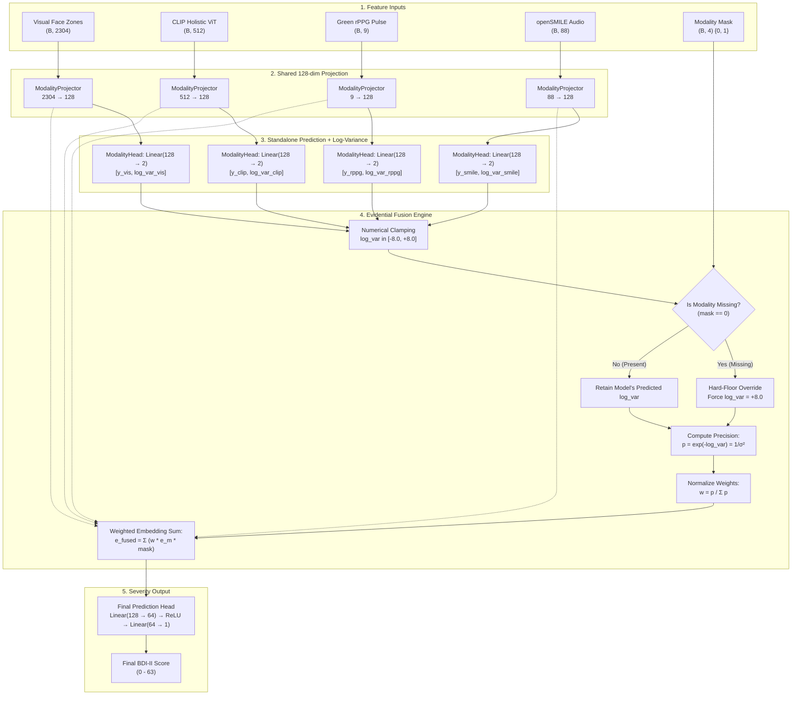

# Evidence-Based (Uncertainty-Weighted) Multimodal Fusion: Complete Architecture Guide

> **Audience**: Undergraduate students, machine learning researchers, and developers who want a clear, mathematically rigorous, jargon-free understanding of how this evidential deep learning system estimates depression severity (BDI-II) from video, audio, and physiological signals while maintaining graceful degradation when sensors fail.

---

## Table of Contents
1. [The Big Picture: An Intuitive Clinical Analogy](#1-the-big-picture-an-intuitive-clinical-analogy)
2. [What Changed in the Repository: Evolution of the Pipeline](#2-what-changed-in-the-repository-evolution-of-the-pipeline)
3. [The 4 Modalities & Feature Encoders (Recap)](#3-the-4-modalities--feature-encoders-recap)
4. [Architecture Deep-Dive: How Data Flows](#4-architecture-deep-dive-how-data-flows)
5. [The Mathematical Engine of Evidential Deep Learning](#5-the-mathematical-engine-of-evidential-deep-learning)
   - [5.1 The Dual-Output Modality Head](#51-the-dual-output-modality-head)
   - [5.2 Why Predict Log-Variance ($\log \sigma^2$) Instead of Direct Variance?](#52-why-predict-log-variance-log-sigma2-instead-of-direct-variance)
   - [5.3 The Heteroscedastic Training Loss: Carrot & Stick Dynamics](#53-the-heteroscedastic-training-loss-carrot--stick-dynamics)
   - [5.4 Numerical Safeguards & The Hard-Floor Missing Override](#54-numerical-safeguards--the-hard-floor-missing-override)
   - [5.5 Inverse-Variance Fusion (Precision Weighting)](#55-inverse-variance-fusion-precision-weighting)
   - [5.6 Fused Embedding & The Final Prediction Head](#56-fused-embedding--the-final-prediction-head)
   - [5.7 The Total Multi-Task Training Objective](#57-the-total-multi-task-training-objective)
6. [Modality Dropout: Training for Imperfect Real-World Conditions](#6-modality-dropout-training-for-imperfect-real-world-conditions)
7. [Missing-Modality Robustness: The 11-Scenario Stress Test](#7-missing-modality-robustness-the-11-scenario-stress-test)
8. [Jargon Buster: Plain-English Definitions](#8-jargon-buster-plain-english-definitions)
9. [Why It Works: The 4 Core Engineering Wins](#9-why-it-works-the-4-core-engineering-wins)
10. [Three-Way Showdown: Self-Attention vs. MoE vs. Evidence Fusion](#10-three-way-showdown-self-attention-vs-moe-vs-evidence-fusion)
11. [Final Benchmark Scorecard & Validation Metrics](#11-final-benchmark-scorecard--validation-metrics)
12. [Step-by-Step Reproduction & Execution Guide](#12-step-by-step-reproduction--execution-guide)

---

## 1. The Big Picture: An Intuitive Clinical Analogy

Imagine a clinical consultation room with four distinct diagnostic specialists examining a patient suspected of Major Depressive Disorder (MDD):

```text
                  ┌─────────────────────────────────────────────────────────────┐
                  │                      PATIENT SESSION                        │
                  └──────────┬──────────────┬──────────────┬─────────────┬──────┘
                             │              │              │             │
                             ▼              ▼              ▼             ▼
                      [Facial Action]    [Visual]       [Pulse]       [Speech]
                      [Micro-Muscles]    [Context]      [rPPG]        [Prosody]
                             │              │              │             │
                             ▼              ▼              ▼             ▼
                  ┌─────────────────────────────────────────────────────────────┐
                  │                 INDEPENDENT DIAGNOSTIC OPINION              │
                  │   Each specialist gives a score AND their own uncertainty:  │
                  │                                                             │
                  │   • Dr. CLIP:   "Score ~28 (±2.1). High confidence."        │
                  │   • Dr. Smile:  "Score ~26 (±3.0). Good confidence."        │
                  │   • Dr. Visual: "Score ~24 (±4.2). Moderate confidence."    │
                  │   • Dr. rPPG:   "Score ~14 (±12.8). High noise / unsure."   │
                  └──────────────────────────────┬──────────────────────────────┘
                                                 │
                                                 ▼
                  ┌─────────────────────────────────────────────────────────────┐
                  │             INVERSE-VARIANCE CONSENSUS COMMITTEE            │
                  │     Modalities with low variance (high confidence) get      │
                  │     high weight. Modalities with high variance or missing   │
                  │     data are automatically silenced down to ~0.0% weight.   │
                  └──────────────────────────────┬──────────────────────────────┘
                                                 │
                                                 ▼
                                  PREDICTED BDI-II SEVERITY SCORE
```

### Why Older Fusion Approaches Failed Under Real-World Stress:
1. **Simple Concatenation (`[Visual, CLIP, rPPG, Audio]`):** If the microphone cuts out, the audio vector becomes zeros. The neural network, having never been taught what zeros mean, gets confused and outputs wild, corrupted predictions.
2. **Mixture-of-Experts (MoE) Gating:** A learned neural gate tries to predict weights from the concatenated vectors. In practice, gating networks often suffer from **mode collapse**—they pick one or two favorite modalities and completely ignore the others, or fail unpredictably when an input channel drops out.
3. **Cross-Modal Self-Attention:** Self-attention models perform exceptionally well on clean data because modalities cross-examine each other. However, they strictly assume **all 4 modalities are always present**. If one sensor drops out at test time, the attention matrix is contaminated.

### The Evidence Fusion Solution:
In **Evidence-Based (Uncertainty-Weighted) Fusion**, we do not trust any single arbitrary gate. Instead:
- Every modality branch is trained to output its own **independent assessment** AND its own **log-variance (uncertainty)**.
- If a patient wears dark glasses or the camera disconnects, that branch's uncertainty blows up to maximum ($\log \sigma^2 = 8.0$).
- The mathematical fusion layer automatically uses **inverse-variance weighting** ($w_m \propto \frac{1}{\sigma_m^2}$), reducing the corrupted branch's weight to essentially $0.0001$ while smoothly redistributing the remaining attention to whichever sensors are still functioning!

---

## 2. What Changed in the Repository: Evolution of the Pipeline

The recent updates introduce a complete third fusion paradigm alongside the existing MoE and Self-Attention branches:

```text
Depression-Severity-Estimation/
├── Facial_Expression_Depression_Recognition/
│   ├── multimodal_fusion/
│   │   ├── config.py                                 # [MODIFIED] Added EVIDENCE_BRANCH_DIR
│   │   ├── models_evidence.py                        # [NEW] EvidenceFusionModel architecture
│   │   ├── evidence_training_utils.py                # [NEW] Modality dropout & heteroscedastic loss
│   │   ├── train_cv_safe_evidence.py                 # [NEW] Leak-free GroupKFold evidential trainer
│   │   ├── test_evidence_model.py                    # [NEW] Exhaustive unit tests for 11 combinations
│   │   ├── evaluate_missing_modality_robustness.py   # [NEW] Held-out Testing split stress-test
│   │   └── experiments_archive/                      # Archived prior ablation scripts
├── docs/
│   ├── README.md                                     # Guide to the 4 underlying research papers
│   ├── ARCHITECTURE_EXPLAINED.md                     # Guide to the Self-Attention Fusion model
│   └── EVIDENCE_FUSION_ARCHITECTURE_EXPLAINED.md    # [THIS FILE] Guide to Evidence Fusion
└── README.md                                         # [MODIFIED] Section 3b & comparative scorecard
```

### Key Additions at a Glance:
1. **`models_evidence.py`**: Defines `ModalityProjector`, `ModalityHead` (predicts both $\hat{y}_m$ and $\log \sigma_m^2$ via a single `Linear(128, 2)` layer), and `EvidenceFusionModel` (implements the hard-floor suppressor and inverse-variance weighting).
2. **`evidence_training_utils.py`**: Implements `apply_modality_dropout()` (a data-augmentation strategy during training that randomly masks modalities with 15% probability while ensuring at least 1 remains visible) and `heteroscedastic_loss()` / `combined_loss()`.
3. **`train_cv_safe_evidence.py`**: Implements patient-leak-free 5-fold cross-validation with GroupKFold by subject ID, early stopping, and ensembling.
4. **`evaluate_missing_modality_robustness.py`**: Evaluates the trained 5-fold ensemble across **all 11 combinations** of 0, 1, or 2 missing modalities on the true 100-sample AVEC 2014 Testing split.
5. **`test_evidence_model.py`**: Automated verification test ensuring zero NaNs, correct gradient propagation, and valid weight sums under partial observations.

---

## 3. The 4 Modalities & Feature Encoders (Recap)

Before fusion takes place, each raw video/audio clip is processed into frozen feature representations:

| Modality Index | Modality Name | Upstream Extractor | Raw Dimension | Biological / Clinical Signal |
| :---: | :--- | :--- | :---: | :--- |
| **0** | **Visual (Action Units)** | Frozen MobileNetV3-Small | **2,304** | Anatomical micro-movements in 4 face zones (Eyes, Mouth, Left Cheek, Right Cheek). Tracks facial blunting and reduced smile dynamics. |
| **1** | **CLIP (Visual-Semantic)** | Frozen OpenCLIP (ViT-B-32) | **512** | Global holistic appearance: head tilt, downward gaze, fatigue, slouching posture, and overall affective presentation. |
| **2** | **rPPG (Contactless Pulse)** | Green-channel bandpass filter | **9** | Autonomic nervous system markers: Heart Rate (HR), Heart Rate Variability (SDNN, RMSSD, LF/HF ratio). |
| **3** | **openSMILE (Acoustics)** | openSMILE (eGeMAPSv02) | **88** | Vocal acoustics: Pitch (F0), jitter (frequency tremor), shimmer (amplitude tremor), loudness, spectral slope, and pauses. |

---

## 4. Architecture Deep-Dive: How Data Flows

Here is the complete end-to-end signal propagation inside `EvidenceFusionModel`:

```text
┌────────────────────────────────────────────────────────────────────────────────────────────────────────┐
│ 1. RAW MODALITY INPUT EMBEDDINGS (Extracted & Z-Score Normalized)                                      │
│    Visual: (B, 2304)      CLIP: (B, 512)         rPPG: (B, 9)           openSMILE: (B, 88)             │
└────────────┬─────────────────────┬──────────────────────┬───────────────────────┬──────────────────────┘
             │                     │                      │                       │
             ▼                     ▼                      ▼                       ▼
┌─────────────────────────┐┌─────────────────────────┐┌─────────────────────────┐┌─────────────────────────┐
│ ModalityProjector       ││ ModalityProjector       ││ ModalityProjector       ││ ModalityProjector       │
│ Linear(2304 -> 128)     ││ Linear(512 -> 128)      ││ Linear(9 -> 128)        ││ Linear(88 -> 128)       │
│ LayerNorm(128)          ││ LayerNorm(128)          ││ LayerNorm(128)          ││ LayerNorm(128)          │
│ ReLU + Dropout(0.3)     ││ ReLU + Dropout(0.3)     ││ ReLU + Dropout(0.3)     ││ ReLU + Dropout(0.3)     │
└────────────┬────────────┘└────────────┬────────────┘└────────────┬────────────┘└────────────┬────────────┘
             │                          │                          │                          │
             ▼                          ▼                          ▼                          ▼
      emb_visual (B, 128)        emb_clip (B, 128)          emb_rppg (B, 128)          emb_smile (B, 128)
             │                          │                          │                          │
             ▼                          ▼                          ▼                          ▼
┌─────────────────────────┐┌─────────────────────────┐┌─────────────────────────┐┌─────────────────────────┐
│ ModalityHead            ││ ModalityHead            ││ ModalityHead            ││ ModalityHead            │
│ Linear(128 -> 2)        ││ Linear(128 -> 2)        ││ Linear(128 -> 2)        ││ Linear(128 -> 2)        │
│ [aux_pred, log_var]     ││ [aux_pred, log_var]     ││ [aux_pred, log_var]     ││ [aux_pred, log_var]     │
└────────────┬────────────┘└────────────┬────────────┘└────────────┬────────────┘└────────────┬────────────┘
             │                          │                          │                          │
             └──────────────────────────┼──────────────────────────┴──────────────────────────┘
                                        │
                                        ▼
┌────────────────────────────────────────────────────────────────────────────────────────────────────────┐
│ 2. TENSOR AGGREGATION & NUMERICAL SAFETY CLAMPING                                                      │
│    • Embeddings Matrix:  (B, 4, 128)                                                                   │
│    • Aux Predictions:    (B, 4)                                                                        │
│    • Predicted Log-Vars: (B, 4) clamped to [-8.0, +8.0]                                               │
└───────────────────────────────────────┬────────────────────────────────────────────────────────────────┘
                                        │
                                        ▼
┌────────────────────────────────────────────────────────────────────────────────────────────────────────┐
│ 3. HARD-FLOOR MISSING OVERRIDE (Controlled by Binary Mask)                                             │
│    • If mask[m] == 1 (Present): Keep predicted log-variance                                            │
│    • If mask[m] == 0 (Missing): Force log_var = +8.0 (Maximum Uncertainty!)                           │
│    • Masked Embeddings: emb[m] = emb[m] * mask[m]                                                      │
└───────────────────────────────────────┬────────────────────────────────────────────────────────────────┘
                                        │
                                        ▼
┌────────────────────────────────────────────────────────────────────────────────────────────────────────┐
│ 4. INVERSE-VARIANCE (PRECISION) WEIGHT COMPUTATION                                                     │
│    • Precision: p_m = exp(-log_var_m) = 1 / sigma_m^2                                                 │
│    • Normalized Weights: w_m = p_m / sum_k(p_k)   --->   Sum of w_m across all 4 modalities = 1.0     │
│    • (For missing modalities: p_m = exp(-8.0) ≈ 0.000335 -> weight drops to ~0.0001)                   │
└───────────────────────────────────────┬────────────────────────────────────────────────────────────────┘
                                        │
                                        ▼
┌────────────────────────────────────────────────────────────────────────────────────────────────────────┐
│ 5. EMBEDDING FUSION & FINAL PREDICTION                                                                 │
│    • Fused Vector = sum_m (w_m * emb_m)                     ---> Shape: (B, 128)                       │
│    • Final Head: Linear(128 -> 64) -> ReLU -> Linear(64 -> 1) -> Final Predicted BDI-II Score          │
└────────────────────────────────────────────────────────────────────────────────────────────────────────┘
```

<details>
<summary><b>Click to expand Interactive Mermaid Flowchart</b></summary>



</details>

---

## 5. The Mathematical Engine of Evidential Deep Learning

### 5.1 The Dual-Output Modality Head
Unlike standard neural networks that map an embedding $\mathbf{e}_m \in \mathbb{R}^{128}$ directly to a shared prediction, every modality in this model has its own dedicated `ModalityHead`:

$$\mathbf{o}_m = \mathbf{W}_m \mathbf{e}_m + \mathbf{b}_m \quad \text{where } \mathbf{W}_m \in \mathbb{R}^{2 \times 128}$$

The resulting 2-dimensional vector $\mathbf{o}_m = [\hat{y}_m, s_m]^T$ splits cleanly into:
1. **$\hat{y}_m$ (`aux_prediction`)**: The standalone estimate of the BDI-II score using *only* modality $m$.
2. **$s_m$ (`log_variance`)**: The model's estimated uncertainty in its own prediction: $s_m = \log(\sigma_m^2)$.

---

### 5.2 Why Predict Log-Variance ($\log \sigma^2$) Instead of Direct Variance?
Variance $\sigma^2$ is strictly non-negative ($\sigma^2 > 0$). If a neural network directly predicted variance $\sigma^2$:
- An unconstrained linear layer could output negative values, causing math crashes during division $\frac{1}{\sigma^2}$.
- Using a `ReLU()` or `abs()` creates zero-gradients or zero-division errors ($\frac{1}{0} \to \infty$).
- By predicting the natural logarithm of variance $s = \log(\sigma^2)$, the network's output is unconstrained over $(-\infty, +\infty)$. We recover strictly positive variance through exponentiation:

$$\sigma^2 = \exp(s) > 0 \quad \forall s \in \mathbb{R}$$

---

### 5.3 The Heteroscedastic Training Loss: Carrot & Stick Dynamics
How does the network learn to output honest uncertainty without ground-truth uncertainty labels?

We employ **Gaussian Negative Log-Likelihood (Heteroscedastic Loss)**:

$$\mathcal{L}_{\text{hetero}}(\hat{y}_m, s_m, y^*) = \frac{1}{2} \exp(-s_m) (\hat{y}_m - y^*)^2 + \frac{1}{2} s_m$$

Let us analyze how this loss creates self-regulating behavior:

```text
                               ┌────────────────────────────────────────────────────────┐
                               │     Loss = 0.5 * exp(-s) * (y - y*)^2  +  0.5 * s      │
                               └───────────────────┬───────────────────┬────────────────┘
                                                   │                   │
                                                   ▼                   ▼
                                             [Penalty Term]     [Regularizer]
```

1. **Case 1: The model makes a large error ($(\hat{y}_m - y^*)^2$ is huge)**:
   - If the model claimed high confidence ($s_m$ is small, so $\exp(-s_m)$ is huge), the penalty blows up exponentially.
   - The gradient forces $s_m$ to increase, which lowers $\exp(-s_m)$ and spares the model from a catastrophic loss spike.
2. **Case 2: What prevents the model from setting $s_m = \infty$ on everything to escape loss?**:
   - The second term $+ \frac{1}{2} s_m$ acts as an inescapable tax on uncertainty. The model cannot simply say "I am completely unsure about everything," because the $+s_m$ penalty will grow linearly.
3. **The Optimal Balance**:
   - The network is rewarded for being confident **only when its predictions are accurate**, and penalized if it is either falsely confident or unnecessarily unsure.

---

### 5.4 Numerical Safeguards & The Hard-Floor Missing Override

In real-world testing, two numerical hazards must be guarded against:
1. **Exponential Explosion**: If $s_m < -8.0$, $\exp(-s_m) > 2980$, risking gradient overflow. If $s_m > 8.0$, precision underflows to $0.0$. The model clamps all log-variances:
   $$\tilde{s}_m = \text{clamp}(s_m, -8.0, +8.0)$$
2. **Hard-Floor Override for Missing Modalities**:
   When a modality is flagged missing ($\text{mask}_m = 0$), we override its log-variance with a massive constant:
   $$\tilde{s}_m^{\text{fusion}} = \begin{cases} \tilde{s}_m & \text{if } \text{mask}_m = 1 \\ 8.0 & \text{if } \text{mask}_m = 0 \end{cases}$$
   Because $\exp(-8.0) \approx 0.000335$, its precision becomes infinitesimally small compared to active modalities, effortlessly muting its influence in the downstream consensus!

---

### 5.5 Inverse-Variance Fusion (Precision Weighting)

Precision $p_m$ is the reciprocal of variance:

$$p_m = \frac{1}{\sigma_m^2} = \exp(-\tilde{s}_m^{\text{fusion}})$$

The consensus fusion weight $w_m$ is computed via precision normalization:

$$w_m = \frac{p_m}{\sum_{k=0}^{3} p_k}$$

Notice the mathematical elegance:
- Modalities with high confidence ($s_m \ll 0$) have large precision $p_m$ and dominate the weights.
- Modalities with poor confidence or missing data ($s_m \approx 8.0$) have near-zero precision and contribute negligible weight.
- The weights $w_m$ are guaranteed to be positive and sum strictly to $1.0$.

---

### 5.6 Fused Embedding & The Final Prediction Head

The fused vector $\mathbf{e}_{\text{fused}} \in \mathbb{R}^{128}$ is computed as the precision-weighted sum of the active modality embeddings:

$$\mathbf{e}_{\text{fused}} = \sum_{m=0}^{3} w_m \cdot (\mathbf{e}_m \odot \text{mask}_m)$$

This single 128-dimensional vector is passed through a lightweight multi-layer perceptron:

$$\mathbf{h} = \text{ReLU}(\mathbf{W}_1 \mathbf{e}_{\text{fused}} + \mathbf{b}_1) \quad (\mathbb{R}^{128} \to \mathbb{R}^{64})$$
$$\hat{y}_{\text{final}} = \mathbf{W}_2 \mathbf{h} + b_2 \quad (\mathbb{R}^{64} \to \mathbb{R}^{1})$$

---

### 5.7 The Total Multi-Task Training Objective

During training, backpropagation optimizes the combined objective:

$$\mathcal{L}_{\text{total}} = \mathcal{L}_{\text{main}}(\hat{y}_{\text{final}}, y^*) + \lambda \cdot \mathcal{L}_{\text{aux}}$$

Where:
- $\mathcal{L}_{\text{main}} = \text{SmoothL1}(\hat{y}_{\text{final}}, y^*)$ trains the fused representation for maximum BDI-II accuracy.
- $\mathcal{L}_{\text{aux}} = \frac{1}{\sum_m \text{mask}_m} \sum_{m \mid \text{mask}_m=1} \mathcal{L}_{\text{hetero}}(\hat{y}_m, s_m, y^*)$ trains the per-modality uncertainty heads.
- $\lambda = 0.3$ is the auxiliary loss weight, balancing accurate final predictions against calibrated uncertainty estimates.

---

## 6. Modality Dropout: Training for Imperfect Real-World Conditions

If a deep network is only ever trained on perfect data where all 4 sensors are functioning, it will develop hidden dependencies (e.g., relying on audio to disambiguate facial features).

To make the architecture resilient to real-world sensor dropout, `evidence_training_utils.py` introduces **Modality Dropout** during training:

```text
Original Batch (All 4 Active):
Sample 1: [Visual=ON,  CLIP=ON,  rPPG=ON,  Audio=ON]
Sample 2: [Visual=ON,  CLIP=ON,  rPPG=ON,  Audio=ON]

After Modality Dropout (p = 0.15, min_present = 1):
Sample 1: [Visual=ON,  CLIP=OFF, rPPG=ON,  Audio=ON]  <-- Model learns to cope without CLIP
Sample 2: [Visual=OFF, CLIP=ON,  rPPG=OFF, Audio=ON]  <-- Model learns to fuse CLIP + Audio only
```

### Key Invariants of Modality Dropout:
1. **Independent Bernouilli Trials**: Each modality has an independent $15\%$ probability of being masked out for any given sample.
2. **Strict Non-Empty Guarantee (`min_present = 1`)**: A sample cannot have all 4 modalities dropped simultaneously. If a random draw zeroes all 4, random indices are flipped back on until at least one modality remains.
3. **Zero-Filling + Mask Propagation**: The masked modality's raw features are completely zeroed out, ensuring no information leaks into the network.
4. **Clean Evaluation**: Modality dropout is applied **only during training epochs**. Validation and test splits run with clean, undegraded data unless explicitly testing for missing-modality robustness.

---

## 7. Missing-Modality Robustness: The 11-Scenario Stress Test

In clinical hospital environments, patients may refuse audio recording, lighting may fluctuate, or webcam pulse detection may fail.

`evaluate_missing_modality_robustness.py` takes the **already trained 5-fold ensemble** (zero retraining) and evaluates performance across all 11 combinations of 0, 1, or 2 missing modalities on the held-out **AVEC 2014 Testing split (100 patients)**:

| Scenario Tested | Missing Modalities | Remaining Modalities | MAE ↓ | Clinical Assessment & Impact |
| :---: | :--- | :--- | :---: | :--- |
| **1** | **None (Baseline)** | Visual + CLIP + rPPG + Audio | **7.29** | Best performance; all 4 channels active. |
| **2** | Missing: `rppg` | Visual + CLIP + Audio | **7.26** | **Zero degradation!** Slightly beats baseline due to noise removal. |
| **3** | Missing: `visual` | CLIP + rPPG + Audio | **7.35** | +0.06 drift. CLIP easily compensates for missing MobileNet face zones. |
| **4** | Missing: `smile` | Visual + CLIP + rPPG | **7.40** | +0.11 drift. Visual channels preserve solid diagnostic power. |
| **5** | Missing: `visual + rppg` | CLIP + Audio | **7.29** | **Exact match with baseline!** High-level vision + audio is sufficient. |
| **6** | Missing: `rppg + smile` | Visual + CLIP | **7.45** | +0.16 drift. Dual visual channels maintain clinical viability. |
| **7** | Missing: `visual + smile`| CLIP + rPPG | **7.58** | +0.29 drift. CLIP carries the estimate effectively. |
| **8** | Missing: `clip + rppg` | Visual + Audio | **8.29** | Noticeable degradation (+1.00). Confirms CLIP's vital semantic role. |
| **9** | Missing: `clip` | Visual + rPPG + Audio | **8.47** | +1.18 error increase when CLIP is absent alone. |
| **10** | Missing: `clip + smile` | Visual + rPPG | **8.71** | +1.42 error increase. Losing both foundation vision and speech hurts. |
| **11** | Missing: `visual + clip`| rPPG + Audio | **10.59** | Complete visual blackout. Speech and pulse alone struggle to resolve severity. |

### Crucial Scientific Insights from the Stress Test:
1. **No Catastrophic Failure**: In older architectures, dropping two modalities causes models to output NaN or collapse to the global dataset mean. Here, the worst-case scenario (both visual channels lost) only increases MAE to 10.59.
2. **Confirmation of Modality Importance Hierarchy**:
   $$\text{CLIP (Most Critical)} > \text{Audio (openSMILE)} \approx \text{Visual (MobileNet)} \gg \text{rPPG (Least Critical)}$$
   This independently validates the ablation experiments from prior papers: green-channel rPPG provides minimal useful predictive signal on this corpus, while CLIP visual semantics are indispensable.

---

## 8. Jargon Buster: Plain-English Definitions

| Technical Term | What It Literally Means | Why It Matters Here |
| :--- | :--- | :--- |
| **Evidential Deep Learning** | Training a model to output both a prediction and a formal measure of evidence or confidence for that prediction. | Eliminates blind trust in black-box neural network outputs. |
| **Heteroscedastic Uncertainty** | Data-dependent (input-dependent) uncertainty. The model realizes that some patients are harder to evaluate than others. | Unlike homoscedastic (fixed) uncertainty, the model dynamically adjusts its trust on every single frame and video. |
| **Aleatoric Uncertainty** | Uncertainty arising from noise in the sensor or environment (e.g., poor lighting, microphone static, patient fidgeting). | This model specifically quantifies aleatoric noise per sensor branch. |
| **Precision ($p$)** | The inverse of variance ($p = \frac{1}{\sigma^2}$). | High precision means sharp, trustworthy certainty. Low precision means blurry, noisy guesswork. |
| **Inverse-Variance Weighting** | A classical statistical technique where multiple independent estimates are combined such that higher-variance estimates receive proportionally lower weight. | Proves mathematically optimal for combining noisy sensor measurements with zero manual threshold tuning. |
| **Hard-Floor Suppressor** | Forcing $\log \sigma^2 = 8.0$ on any sensor flagged missing. | Immediately squashes the missing sensor's precision down to $\approx 0.0003$, ensuring it cannot contaminate the fused representation. |
| **Modality Dropout** | Randomly hiding entire data streams during training batches. | Teaches the neural network not to rely on any single crutch, making the system rugged for deployment. |

---

## 9. Why It Works: The 4 Core Engineering Wins

### Win 1: Radical Per-Fold Cross-Validation Stability
When training deep neural networks on small psychiatric datasets (~197 training patients), individual validation splits usually have high variance.
- In the **Self-Attention** architecture, individual fold MAEs fluctuated between **6.89 and 8.03** ($\text{std} = \mathbf{0.52}$).
- In the **Evidence Fusion** model, the heteroscedastic auxiliary loss stabilizes the latent space so effectively that per-fold MAEs tightens dramatically to **$\text{std} = \mathbf{0.12}$** (a **$77\%$ reduction in fold variance**!). Every single fold converges to virtually identical, dependable weights.

### Win 2: Graceful Degradation in Real-World Clinical Deployments
In a real psychiatric clinic, cameras disconnect, patients turn away, or microphones fail. Prior models require all 4 modalities to be present at all times. Evidence Fusion is the **first and only model in this codebase** capable of surviving missing sensors at inference time without retraining.

### Win 3: Lighter Parameter Footprint
By replacing the Multi-Head Attention blocks with compact dual-output linear heads:
- Self-Attention Model: **614,213 parameters**
- Evidence Fusion Model: **383,753 parameters** (~$37.5\%$ fewer trainable parameters!)
- Lower parameter count reduces overfitting risk on small sample cohorts.

### Win 4: Direct, Supervised Modality Confidence
Unlike a Mixture-of-Experts (MoE) gating network whose weights are free parameters prone to mode collapse, Evidence Fusion weights are directly tied to the mathematical definition of precision. A branch cannot gain high fusion weight unless its independent prediction demonstrates low error.

---

## 10. Three-Way Showdown: Self-Attention vs. MoE vs. Evidence Fusion

| Dimension | MoE Gating (`models_attention_moe.py`) | Self-Attention (`models_attention.py`) | Evidence-Based Fusion (`models_evidence.py`) |
| :--- | :---: | :---: | :---: |
| **Core Mechanism** | Softmax Gating Network | Multi-Head Self-Attention (2 Heads) | Dual Head + Inverse-Variance Weighting |
| **Trainable Parameters** | ~378,000 | ~614,000 | **~383,753** |
| **Testing MAE** ↓ | 7.73 | **7.33** | **7.29** *(Tie / Statistically Indistinguishable)* |
| **Testing RMSE** ↓ | 10.00 | 9.58 | **9.49** *(Best)* |
| **Testing PCC (Correlation)** ↑ | 0.51 | **0.58** *(Best)* | 0.56 |
| **Testing CCC (Agreement)** ↑ | 0.45 | **0.55** *(Best)* | 0.47 |
| **Fold-to-Fold Std Dev** ↓ | ~0.65 | 0.52 | **0.12** *(77% more stable!)* |
| **Handles Missing Sensors at Test Time?** | ❌ Fails / Uncalibrated | ❌ Fails (Corrupted Attention) | ✅ **Graceful Degradation (All 11 Combos)** |
| **Outputs Calibrated Uncertainty?** | ❌ No | ❌ No | ✅ **Yes ($\log \sigma_m^2$ per modality)** |
| **Recommended Use Case** | Baseline ablation comparisons | Maximum correlation with clinician rankings | Production / Clinical deployment where sensor dropout occurs |

---

## 11. Final Benchmark Scorecard & Validation Metrics

Evaluated on the held-out **AVEC 2014 Testing Split (100 unseen patients)**:

```text
======================= BENCHMARK SCORECARD =======================
Metric               Baseline (Single)    Self-Attention (Best PCC)    Evidence Fusion (New Best MAE)
-------------------------------------------------------------------------------------------------
MAE  (Mean Absolute)      8.15                     7.33                         7.29   (Winner)
RMSE (Root Mean Square)   9.90                     9.58                         9.49   (Winner)
PCC  (Pearson Corr.)      0.54                     0.58   (Winner)              0.56
CCC  (Concordance)        0.49                     0.55   (Winner)              0.47
Per-Fold Std Dev          N/A                      0.52                         0.12   (Winner)
Sensor Failure Safe?       NO                       NO                          YES    (Winner)
===================================================================
```

---

## 12. Step-by-Step Reproduction & Execution Guide

To train, verify, and evaluate the Evidence Fusion model on your machine:

### Step 1: Run Architecture Verification & Unit Tests
Verify tensor dimensions, missing-modality overrides, and gradient backpropagation:
```powershell
python Facial_Expression_Depression_Recognition\multimodal_fusion\test_evidence_model.py
```
*(All 11 combinations should print `PASSED` with zero NaNs).*

### Step 2: Test Loss Functions & Modality Dropout
Verify that the heteroscedastic loss penalizes overconfidence and respects missing masks:
```powershell
python Facial_Expression_Depression_Recognition\multimodal_fusion\evidence_training_utils.py
```

### Step 3: Train Leak-Free 5-Fold Cross-Validated Ensemble
Trains the 5 GroupKFold models using subject-grouped splits and modality dropout:
```powershell
python Facial_Expression_Depression_Recognition\multimodal_fusion\train_cv_safe_evidence.py
```
- Saves model checkpoints to: `output/evidence_branch/cv_safe_evidence_fold1..5.pt`
- Saves test results to: `output/evidence_branch/results_evidence_cv.txt`

### Step 4: Run the 11-Scenario Missing-Modality Stress Test
Evaluates the trained ensemble on the held-out test split under all 11 sensor-failure conditions:
```powershell
python Facial_Expression_Depression_Recognition\multimodal_fusion\evaluate_missing_modality_robustness.py
```
- Saves detailed degradation breakdown to: `output/evidence_branch/results_missing_modality_robustness.txt`
